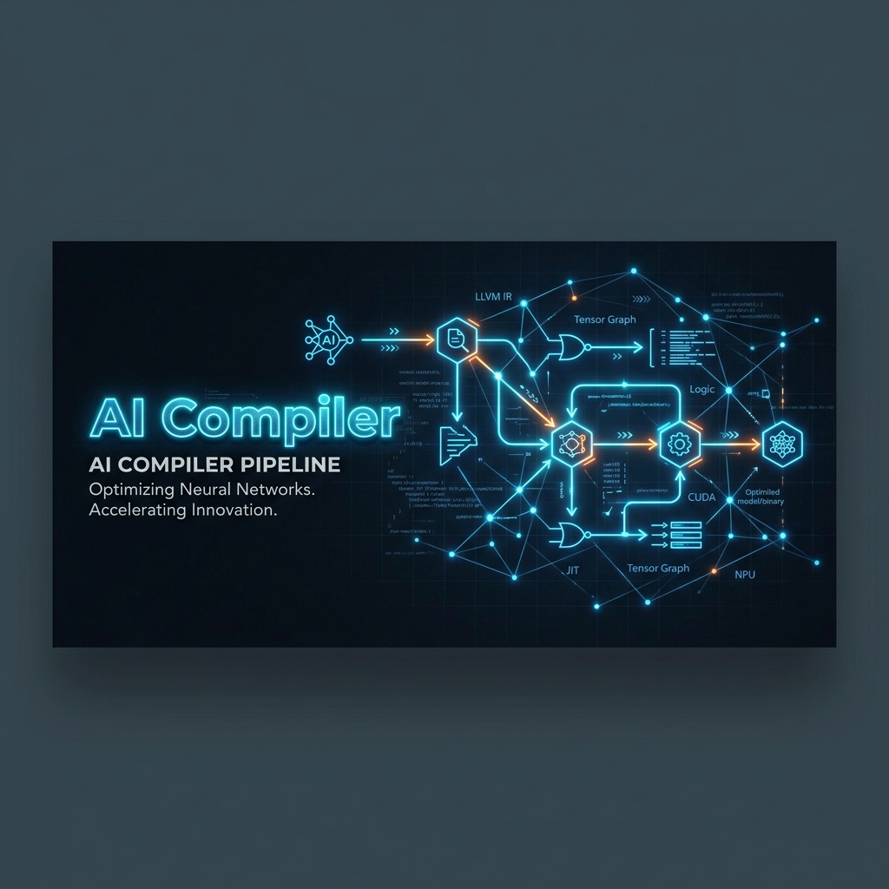
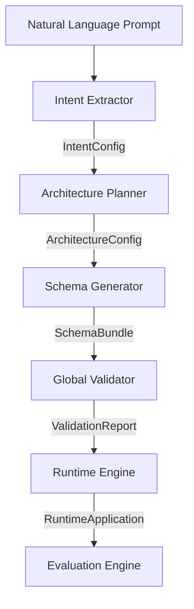

<div align="center">
  

  # 🚀 AI Compiler Pipeline

  **A next-generation backend engine transforming natural language into fully deterministic, validated application structures.**

  [](https://www.python.org)
  [](https://deepmind.google/technologies/gemini/)
  [](https://docs.pydantic.dev/)
  [](#license)
</div>

---

## 🎯 The Problem

Building modern applications via LLMs is traditionally error-prone, non-deterministic, and prone to hallucinations. Generative AI tools often skip crucial architectural planning steps, resulting in applications that break during runtime due to missing database relationships, orphaned API endpoints, or un-routed UI pages.

**Our Solution:** A system that acts like a strict traditional compiler—validating dependencies, ensuring completeness, and automatically repairing errors layer-by-layer before any code is ever executed.

---

## ⚙️ Pipeline & Architecture

The system is built on a rigorous **5-stage pipeline**, strictly segregating business intent from deterministic execution.



*Above: The data flow through the compiler stages, ensuring rigid validation.*

---

## 🚀 Getting Started

### Prerequisites

- Python 3.10+
- A valid Gemini API Key (`GEMINI_API_KEY`)

### Installation

1. **Clone the repository:**
   ```bash
   git clone https://github.com/yourusername/ai-compiler-pipeline.git
   cd ai-compiler-pipeline
   ```

2. **Set up the virtual environment:**
   ```bash
   python -m venv .venv
   source .venv/bin/activate  # On Windows: .venv\Scripts\activate
   ```

3. **Install dependencies:**
   ```bash
   pip install -r requirements.txt
   ```

4. **Environment Variables:**
   Create a `.env` file in the root directory:
   ```env
   GEMINI_API_KEY=your_gemini_api_key_here
   ```

---

## 💻 Usage & Demo

### 1. End-to-End Demo
Watch the compiler execute a prompt from start to finish, generating deterministic application structures.

```bash
python demo.py
```
*(Tip: You can record your terminal using tools like Terminalizer or Asciinema and place the `.gif` here to showcase the pipeline in action)*

### 2. Full Evaluation Suite
Run the 20-prompt dataset (Normal + Edge Cases) to generate metrics, cost analysis, and deterministic benchmarks.

```bash
python backend/evaluation/run_full_evaluation.py
```

---

## 📊 Evaluation Results

Our evaluation suite rigorously tests the system across **20 distinct scenarios**. 
Read the full report in [`backend/evaluation/evaluation_report.md`](backend/evaluation/evaluation_report.md).

- **🛡️ 100% Determinism Score:** The pipeline generates identical `runtime_hash`es across multiple runs of the same prompt.
- **⚡ Latency vs. Quality:** By leveraging pure Python mappings for structural code generation rather than expensive LLM calls, we drastically reduce tokens consumed and pipeline latency. LLMs are strictly used for high-level Architectural and Intent stages.

---

## ⚖️ Tradeoffs

1. **Flexibility vs. Determinism:** Because we force the LLM to output highly restricted configurations, we trade off absolute creative freedom for structural safety.
2. **Hybrid Generation:** We rely on standard heuristics (e.g., entity `Contact` generates a `contacts` table and `GET /contacts` endpoint) via Python code rather than LLM scaffolding. This cuts token cost and hallucination risk, but limits unconventional naming conventions.

---

## 🔮 Future Work

- [ ] **Frontend Builder Dashboard**: Implement a simple React UI to visually step through compilation stages.
- [ ] **Advanced Repair Engines**: Introduce AST-level code repair for cases where the LLM fundamentally hallucinates a schema dependency.
- [ ] **Multi-Modal Input**: Allow the Intent Extractor to parse UI wireframes alongside text prompts.

<div align="center">
  <b>Built with ❤️ for deterministic AI generation</b>
</div>
