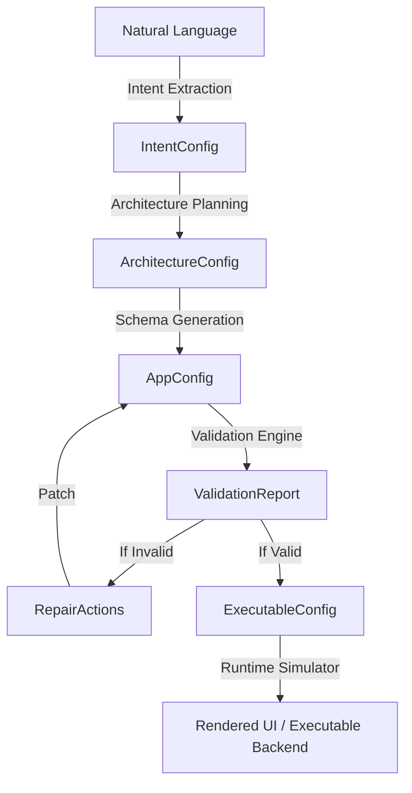
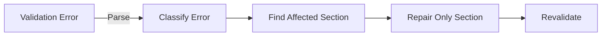
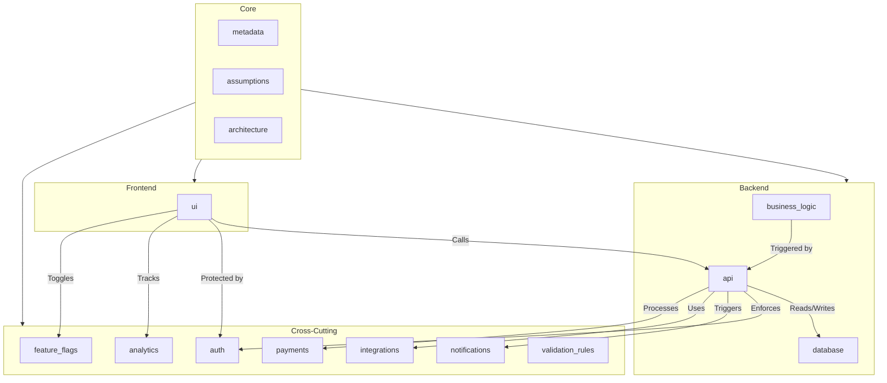

# Production-Grade AppConfig Master Schema Design Document

## 1. AppConfig Lifecycle

The compiler pipeline transforms unstructured intent into an executable application configuration through a strict multi-stage lifecycle:

## 2. 3-Layer Validator Design

We do not validate only JSON syntax. We apply a 3-layer validation strategy:

1. **Layer 1: JSON Validation (Pydantic)**
   Ensures the output is well-formed JSON and parses into basic types.
2. **Layer 2: Schema Validation**
   Validates required fields, enums, regex patterns, constraints (min/max bounds).
3. **Layer 3: Consistency Validation (Cross-layer checks)**
   Validates business logic and architectural consistency. For example, if the UI references `customer_name`, but the API provides `client_name`, Layer 3 catches this mismatch and triggers a repair.

## 3. Targeted Repair Engine Design

> [!CAUTION]
> Most naive implementations use `if invalid: regenerate_everything()`. This is brittle and expensive.

Instead, we use a targeted repair strategy:

**Example:** If the API section references a missing `contacts` table in the DB, the Repair Engine explicitly prompts the LLM: *"The API schema references table 'contacts' which does not exist in the Database schema. Please generate the 'contacts' table structure."* It **only** regenerates the database section, drastically improving determinism.

## 4. Architecture Diagram

## 5. Master Schema Sections

### 1. Metadata
* **Purpose**: Identifies the application, version, and general metadata.
* **Structure**: App name, semantic version, description.
* **Example JSON**: `{"metadata": {"app_name": "CRM", "version": "1.0.0"}}`
* **Validation**: `app_name` required, `version` must match semver regex.

### 2. Assumptions
* **Purpose**: Tracks implicit assumptions made by the LLM during intent extraction.
* **Structure**: ID, description, impact level.
* **Example JSON**: `{"assumptions": [{"id": "A1", "description": "Users need email login", "impact_level": "high"}]}`
* **Validation**: `impact_level` enum (low, medium, high).

### 3. Architecture
* **Purpose**: Defines the high-level system topology.
* **Structure**: Style (monolith/microservices), technologies.
* **Example JSON**: `{"architecture": {"style": "monolith", "technologies": ["react", "fastapi", "postgresql"]}}`
* **Validation**: `style` enum.

### 4. Database
* **Purpose**: Defines data storage entities and relationships.
* **Structure**: Tables, columns, types, primary/foreign keys.
* **Example JSON**: `{"database": {"tables": [{"name": "users", "columns": [{"name": "id", "type": "uuid", "is_primary_key": true}]}]}}`
* **Validation**: Names must be snake_case, valid types.

### 5. API
* **Purpose**: Defines communication contracts between frontend and backend.
* **Structure**: Endpoints, methods, parameters, roles.
* **Example JSON**: `{"api": {"endpoints": [{"path": "/users", "method": "GET", "required_roles": ["admin"]}]}}`
* **Validation**: Valid HTTP methods, paths start with `/`.

### 6. UI
* **Purpose**: Defines frontend pages and structural components.
* **Structure**: Pages, components (tables, forms), data sources.
* **Example JSON**: `{"ui": {"pages": [{"path": "/dashboard", "name": "Dashboard", "components": []}]}}`
* **Validation**: Component types enum, paths must be valid routes.

### 7. Auth
* **Purpose**: Defines security and access control.
* **Structure**: Providers, roles, permissions.
* **Example JSON**: `{"auth": {"providers": ["jwt"], "roles": [{"name": "admin", "permissions": ["all"]}]}}`
* **Validation**: Providers enum, roles must have unique names.

### 8. Business Logic
* **Purpose**: Defines complex backend workflows and conditions.
* **Structure**: Rules, conditions, actions.
* **Example JSON**: `{"business_logic": {"rules": [{"id": "R1", "condition": "user.age < 18", "action": "deny_registration"}]}}`
* **Validation**: Rule IDs unique, actions mapped to valid handlers.

### 9. Integrations
* **Purpose**: Third-party service configurations.
* **Structure**: Services, provider names, config keys.
* **Example JSON**: `{"integrations": {"services": [{"name": "stripe_billing", "provider": "stripe", "purpose": "payments"}]}}`
* **Validation**: Recognized provider enumerations.

### 10. Payments
* **Purpose**: E-commerce and billing definitions.
* **Structure**: Enabled flag, provider, currency.
* **Example JSON**: `{"payments": {"enabled": true, "provider": "stripe", "currency": "USD"}}`
* **Validation**: Currency ISO codes.

### 11. Notifications
* **Purpose**: Outbound user communication templates.
* **Structure**: Templates, channels (email, sms).
* **Example JSON**: `{"notifications": {"templates": [{"id": "welcome_email", "channel": "email"}]}}`
* **Validation**: Channel enum.

### 12. Analytics
* **Purpose**: Telemetry and product metrics.
* **Structure**: Events, properties.
* **Example JSON**: `{"analytics": {"events": [{"name": "user_signup", "properties": ["source"]}]}}`
* **Validation**: Event names must be unique.

### 13. Feature Flags
* **Purpose**: Runtime toggles for gradual rollouts.
* **Structure**: Flags, default states.
* **Example JSON**: `{"feature_flags": {"flags": [{"name": "new_ui", "default_state": false}]}}`
* **Validation**: Boolean default states.

### 14. Validation Rules
* **Purpose**: Systemic, cross-layer constraints.
* **Structure**: Rules, expressions, severities.
* **Example JSON**: `{"validation_rules": {"cross_layer_rules": [{"id": "V1", "severity": "error", "expression": "api.endpoints.every(e => auth.roles.includes(e.required_roles))"}]}}`
* **Validation**: Severity enum (warning/error).

## 6. Cross-Layer Consistency Validation Rules (50 Rules)

The following 50 rules must be implemented in the Layer 3 Consistency Validator to ensure the generated AppConfig is a functionally cohesive application, not just valid JSON.

### DB <-> API (1-10)
1. **API Endpoints to DB Tables:** Every API endpoint referencing a resource must map to an existing Database table.
2. **API Path Variables:** API path variables (e.g., `/users/{id}`) must map to a primary key in the corresponding DB table.
3. **POST Payload Matching:** API POST endpoint parameters must map to writable columns in the associated DB table.
4. **GET Query Filters:** API query parameters used for filtering must map to valid columns in the DB table.
5. **Foreign Key Integrity:** If an API endpoint joins two resources (e.g., `/users/{id}/posts`), a foreign key relationship must exist between them in the DB.
6. **Required Fields on Insert:** DB columns marked `is_required=True` without default values MUST be required parameters in the API POST endpoint.
7. **Type Matching (String):** An API parameter typed `string` must map to a DB column typed `string` or `uuid`.
8. **Type Matching (Int):** An API parameter typed `integer` must map to a DB column typed `integer`.
9. **Delete Constraints:** API DELETE methods must reference a resource that has a primary key defined in the DB.
10. **Pagination Parameters:** Endpoints returning lists must support `limit` and `offset` if the DB table is not a lookup table.

### API <-> UI (11-20)
11. **UI Data Sources:** Every `data_source` in a UI component must map to a valid API endpoint path.
12. **Form Inputs to API Params:** Every field in a UI `form` component must exactly match an expected parameter in the target API endpoint.
13. **Table Columns to API Response:** UI `table` columns must map to fields present in the associated API response schema.
14. **Required UI Fields:** UI form fields mapped to `required` API parameters must also be marked as required in the UI definition.
15. **Method Matching:** UI Form submissions for new records must point to `POST` endpoints.
16. **Update Method Matching:** UI Form submissions for editing records must point to `PUT` or `PATCH` endpoints.
17. **Delete Actions:** UI "Delete" buttons must point to API endpoints with the `DELETE` method.
18. **Dropdown Data:** UI dropdowns referencing external relations (e.g., select user for a post) must map to a `GET` API endpoint providing that list.
19. **Route Consistency:** UI paths must not conflict with API base routes (e.g., avoid UI `/api/v1/...`).
20. **Error Handling:** The UI components must define error states if the corresponding API endpoints define error responses.

### Auth <-> UI / API (21-30)
21. **UI Protected Routes:** Any UI page with `required_roles` must only reference roles defined in `auth.roles`.
22. **API Protected Routes:** Any API endpoint with `required_roles` must only reference roles defined in `auth.roles`.
23. **Login Page Exists:** If `auth` providers are defined, a UI page for "Login" or authentication must exist.
24. **Token Handling:** If `auth` uses JWT, the API endpoints must accept headers/cookies for authorization.
25. **Admin Consistency:** If an `admin` role exists, there must be at least one UI page restricted to `admin`.
26. **Role Hierarchy:** API endpoints with `admin` requirements must not be accessible via UI components exposed to `guest`.
27. **Registration Endpoint:** If a UI "Signup" page exists, there must be an API `POST` endpoint for user creation.
28. **Logout Action:** The UI must contain a logout action if an Auth system is active.
29. **OAuth Callbacks:** If `oauth2` is a provider, an API endpoint for the OAuth callback must exist.
30. **Permissions Map:** Any specific permission string referenced in API/UI must be assigned to at least one role in `auth.roles`.

### Business Logic <-> DB / API / UI (31-40)
31. **Rule Entity Validity:** Business rules must only reference tables that exist in the DB schema.
32. **Action Handlers:** Business rule `action`s must map to backend function stubs or API endpoint triggers.
33. **Trigger Points:** API endpoints modifying critical DB tables must have associated business rules (e.g., payments).
34. **Rule Field Validity:** Fields used in business rule `condition` expressions must exist in the DB.
35. **Validation Sync:** Business rules defining input validations must be reflected in UI form constraints (Layer 3 sync).
36. **Notification Triggers:** Business rules triggering notifications must reference templates defined in `notifications`.
37. **Payment Rules:** Business rules processing transactions must only exist if `payments.enabled = true`.
38. **Analytics Hooks:** Business rules tracking conversions must reference valid `analytics.events`.
39. **State Machines:** If business logic defines state transitions (e.g., status='draft' -> 'published'), the DB table must have a `status` column.
40. **Soft Deletes:** If business logic requires retention, the DB must have an `is_deleted` or `deleted_at` column instead of hard deletes.

### Cross-Cutting (Integrations, Payments, Analytics, Notifications, Features) (41-50)
41. **Payment Endpoints:** If `payments.enabled = true`, the API must include a webhook endpoint matching `webhook_endpoint`.
42. **Notification Channels:** `notification` templates must only use channels (e.g., email) supported by the backend architecture.
43. **Event Properties:** `analytics.events` properties must map to data available at the time the event is fired in the UI/API.
44. **Feature Flag UI:** If a feature flag exists (e.g., `new_dashboard`), the UI schema must reference this flag for conditional rendering.
45. **Integration Configs:** Any service defined in `integrations` must have corresponding environment variables or keys documented.
46. **Email Provider:** If `notifications` uses `email`, an email provider must be present in `integrations`.
47. **Payment Provider:** If `payments` uses `stripe`, Stripe must be listed in `integrations`.
48. **Flag Defaults:** Feature flags marked `default_state=false` cannot be the sole entry point to required application functionality.
49. **Assumptions Traceability:** High-impact `assumptions` must directly map to at least one generated UI page or API endpoint.
50. **Metadata Consistency:** The `metadata.version` must follow semantic versioning rules, and major version bumps must correspond to structural DB/API changes.

## 7. Versioning Strategy

To evolve the `AppConfig` schema over time without breaking compatibility, we recommend the following approach:

- **Strict SemVer for Schema:** The schema itself must be versioned (v1, v2, v3).
- **Additive Changes (Minor version):** Adding new optional fields or new sections (e.g., adding `feature_flags` in v1.1) is safe. Use `Optional[T] = None`.
- **Breaking Changes (Major version):** Renaming fields, changing types, or making an optional field required. For major updates:
  - Create a migration pipeline (e.g., `migrate_v1_to_v2.py`) that translates legacy JSON into the new structure.
  - The runtime parser checks `metadata.version` and applies migrations in memory before execution.
- **`ConfigDict(extra='allow')`:** The Pydantic model for the top-level config explicitly allows extra fields, so beta features can be injected by the LLM without crashing validation layers, later being formalized into the strict schema.

## 8. Runtime Execution Proof

To satisfy the "execution awareness" requirement, the runtime must prove that the generated JSON is functionally viable. 
We achieve this through the **Runtime Simulator** (`backend/runtime/runtime_simulator.py`), which:
1. Loads `app_config.json`.
2. Parses the `ui` section.
3. Dynamically generates a lightweight HTML/JS representation or a React node tree showing:
   - A Navigation bar built from `ui.pages`.
   - Dummy table and form components bound to `api.endpoints`.
4. Outputs this as an interactive preview, proving the config compiles to working software.
